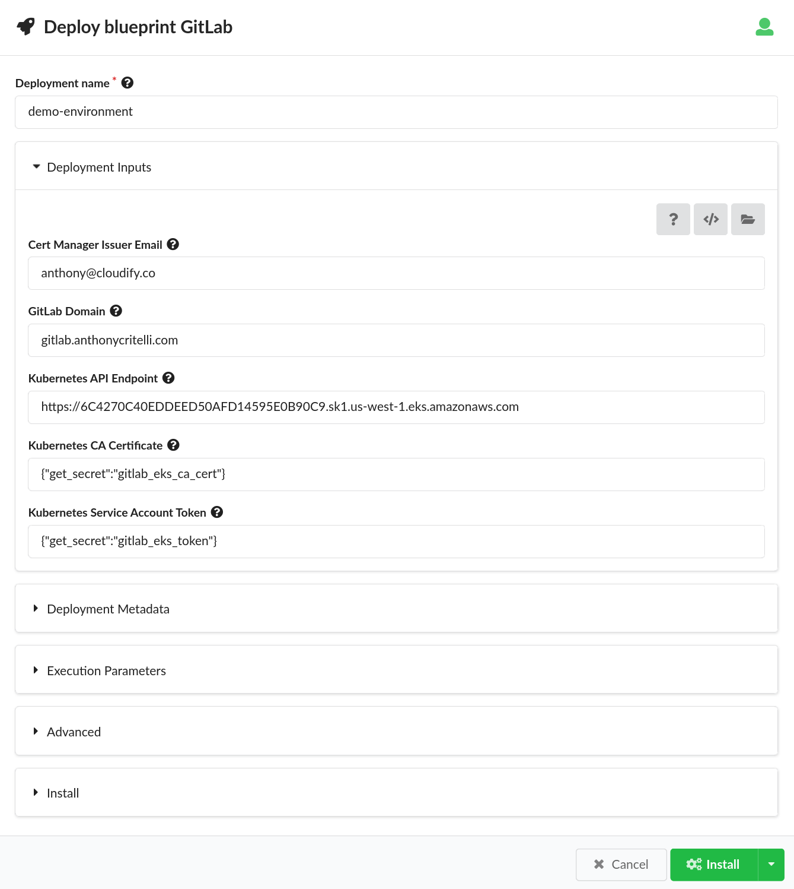

# Gitlab All-in-One Blueprint

This blueprint deploys the proof of concept [GitLab Helm chart](https://docs.gitlab.com/charts/). This chart deploys all GitLab components to a Kubernetes cluster and is only suitable for a POC environment.

The blueprint creates the `gitlab` namespace and deploys two charts:

1. [cert-manager](https://cert-manager.io/) 
2. GitLab

## Usage

Two secrets must be created in the Cloudify Manager to use the blueprint:

* `gitlab_eks_ca_cert` - PEM-encoded CA certificate for the Kubernetes cluster
* `gitlab_eks_token` - Service-account token for the Kubernetes cluster. See the [documentation](https://docs.cloudify.co/latest/working_with/official_plugins/orchestration/kubernetes/#token-based-authentication) for instructions on generating an SA token.

The easiest way to upload a PEM-encoded certificate is to perform a file based upload via the UI or CLI to ensure that newlines are preserved. For example, using the CLI:

```bash
$ cat /tmp/cert.pem 
-----BEGIN CERTIFICATE-----
MIIC/jCCAeagAwIBAgIBADANBgkqhkiG9w0BAQsFADAVMRMwEQYDVQQDEwprdWJl
cm5ldGVzMB4XDTIyMTIwODE2Mjg1MVoXDTMyMTIwNTE2Mjg1MVowFTETMBEGA1UE
AxMKa3ViZXJuZXRlczCCASIwDQYJKoZIhvcNAQEBBQADggEPADCCAQoCggEBAM8Y
kwMcjmB/17+M2OXfM4FfPf6phXM+tzAD/Q7w/GuyYUBJune4jkRhUe8TGwzk2hDL
WkP4C9SfuzKJZdjwtAc7sxsWBxQeS7vTYmPYXpjVKLa2f50NNZf8M1F5BcxiP+ls
b6wrDW0uUvVURb6jpc+3PLr5zuN/2iL71XZmWcNyUvkvqACLEBJuVY3r5AmBwwqd
V7qFi0ZTW+OaupzZCrmaZfoE1B0mf00+Qh24vF7BlNx9UhV9V0F6ePJtMNrzvc/m
iaBGPEGZX+8IFJ6C/qqrQmumkuhGDZwnQkHPsX6fHW+qD1QUSYu/t1BR4fTz+XKM
kZtNj872corXIYAXsKMCAwEAAaNZMFcwDgYDVR0PAQH/BAQDAgKkMA8GA1UdEwEB
/wQFMAMBAf8wHQYDVR0OBBYEFJqR5NnsvhRwfMAR9Zayg7jrTUxfMBUGA1UdEQQO
MAyCCmt1YmVybmV0ZXMwDQYJKoZIhvcNAQELBQADggEBACd5LvBimwQeW//Aqg3v
f0MnE3dxPF79koLJErxDaPvCbWVe+KCa54vbqnyT7Vut1iFD71hrYD3ODgEQzxek
lf43YFBnzGAQoHSHK8mEIXfUJmfrywT+IOyUABi1WhvpbLAmlgwAPkK+Itqi1zWn
VfjyL7awhXuK7uJMIJxtvh7pleQ0xJT6S/AHfW1CU/QbCTSDQ//23nKElJePiZlc
yAeJBWREXehJYo3yWucTE7l40ZENDOPpY0Nzm2JjR+XniMOuzP5gSUBz/by+iiY8
6TfXr5ZNzcJPB2E36iS0DQrDoukbp/LXYOoYvto9TpqKm4Kg8yo6iNcSn2qsgzue
ZBw=
-----END CERTIFICATE-----

$ cfy secrets create -uf /tmp/cert.pem gitlab_eks_ca_cert
Secret `gitlab_eks_ca_cert` created
```

Next upload the blueprint via the UI or CLI:

```bash
$ cfy blueprint upload -b GitLab blueprint.yaml
Uploading blueprint blueprint.yaml...
 blueprint.yaml |######################################################| 100.0%
Blueprint `GitLab` upload started.
2022-12-09 15:10:13.969  CFY <None> Starting 'upload_blueprint' workflow execution
2022-12-09 15:10:14.044  LOG <None> INFO: Blueprint archive uploaded. Extracting...
2022-12-09 15:10:14.281  LOG <None> INFO: Blueprint archive extracted. Parsing...
2022-12-09 15:10:16.870  LOG <None> INFO: Blueprint parsed. Updating DB with blueprint plan.
2022-12-09 15:10:17.204  CFY <None> 'upload_blueprint' workflow execution succeeded
Blueprint uploaded. The blueprint's id is GitLab
```

Finally, create a new deployment. Be sure to customize the Cert Manager Issuer Email, GitLab Domain, and Kubernetes API Endpoint to match your environment:



## Outputs

The blueprint exposes the Ingress endpoint as a capability. This endpoint can be added to DNS for the GitLab domain as per the [official documentation](https://docs.gitlab.com/charts/quickstart/#retrieve-the-ip-address).

## Note about cert-manager

The cert-manager installation is handled as a separate Helm chart as there is a race condition somewhere in the GitLab charts that will attempt to create cert-manager resources before cert-manager has been fully installed. This can be discovered with the `--wait` flag to Helm install:

```bash
$ helm install --set global.hosts.domain='gitlab.anthonycritelli.com' --set certmanager-issuer.email='anthony@cloudify.co' --namespace gitlab --wait gitlab gitlab/gitlab
Error: INSTALLATION FAILED: customresourcedefinitions.apiextensions.k8s.io "challenges.acme.cert-manager.io" not found
```
